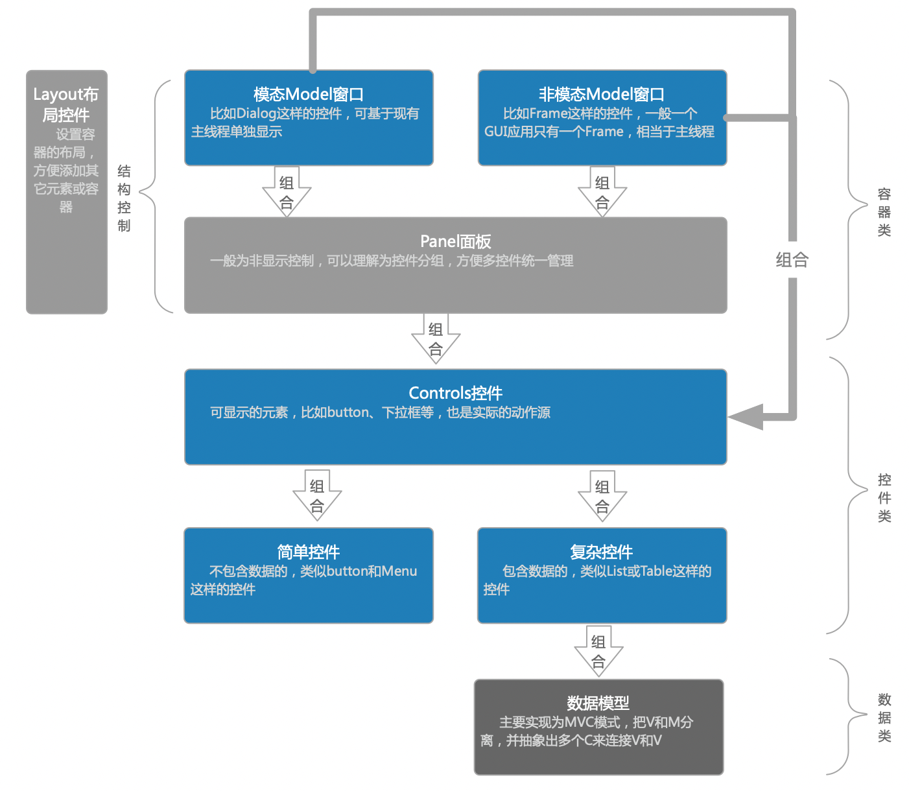
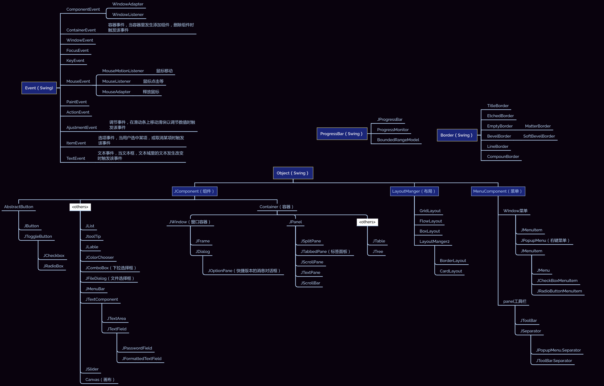

## Plugin Lean

### 资料

- 网上：
  - https://blog.csdn.net/liudonglovehemin/category_12311000.html

- 官方：
  - DOC：https://plugins.jetbrains.com/docs/intellij/plugins-quick-start.html
  - UI： https://jetbrains.design/intellij/
- 项目：
  - Template：https://github.com/JetBrains/intellij-platform-plugin-template#getting-started
  - 开发平台（IntelliJ Platform）：https://github.com/JetBrains/intellij-community

### 线程管理

- ProgressManager
- 在所有情况下，在后台执行的代码都会关联一个ProgressIndicator对象，当前线程的信息可通过ProgressIndicatorProvider.getGlobalProgressIndicator()查询
- 例如任务已完成这样的可视化后台线程可以通过ProgressIndicator对象来通知用户当前线程的执行状态，也可通过ProgressIndicator.cancel()来取消线程任务的执行。必要时可抛出ProcessCanceledException异常来终止后台进程，这个异常不应该用于日志打印，而是被重新抛出然后在最顶层的基础设施中被处理。
- 对于比较耗时的操作，可以通过在代码中比如for循环代码中插入checkCanceled()来检查当前任务是否被取消了，如果取消了则结束当前线程。取消操作有两种：
  - UI 线程：调用ReadAction.nonBlocking()返回NonBlockingReadAction(NBRA)，如果调用了上述方法未生效，比如虽取消了线程但窗口依然未关闭，此时可再调用expireWith() or expireWhen()来修复；
  - 如果是后台线程：循环调用ProgressManager.getInstance().runInReadActionWithWriteActionPriority()，直到所有任务都取消。
  - 基于文件索引：调用ReadAction.nonBlocking(...).inSmartMode()

### UI Swing

**EditorTextField**：**JTextArea**替换成IntelliJ平台的编辑器组件增加了：语法高亮支持、代码完成、代码折叠等功能；
**JBTList**：替换**JList**
**JBTree**：替换**JTree**：
**文件选择器：可按需要使用**FileChooser**、**TreeClassChooserFactory**和**PackageChooserDialog**，后面两个是针对类和包的；**
**Messages**：可通过**showCheckboxMessageDialog()**方法创建简单的消息框；
**JBSplitter**：替换**JSplitPane**
**JBTabs**：替换**TabbedPane**
**Toolbars**：替换**JToolBar**
**对于其它的控件也建议换成**IDEA**的，方法就是把原来**Swing**控件的类名由**J**开头换成**JB开头即可。